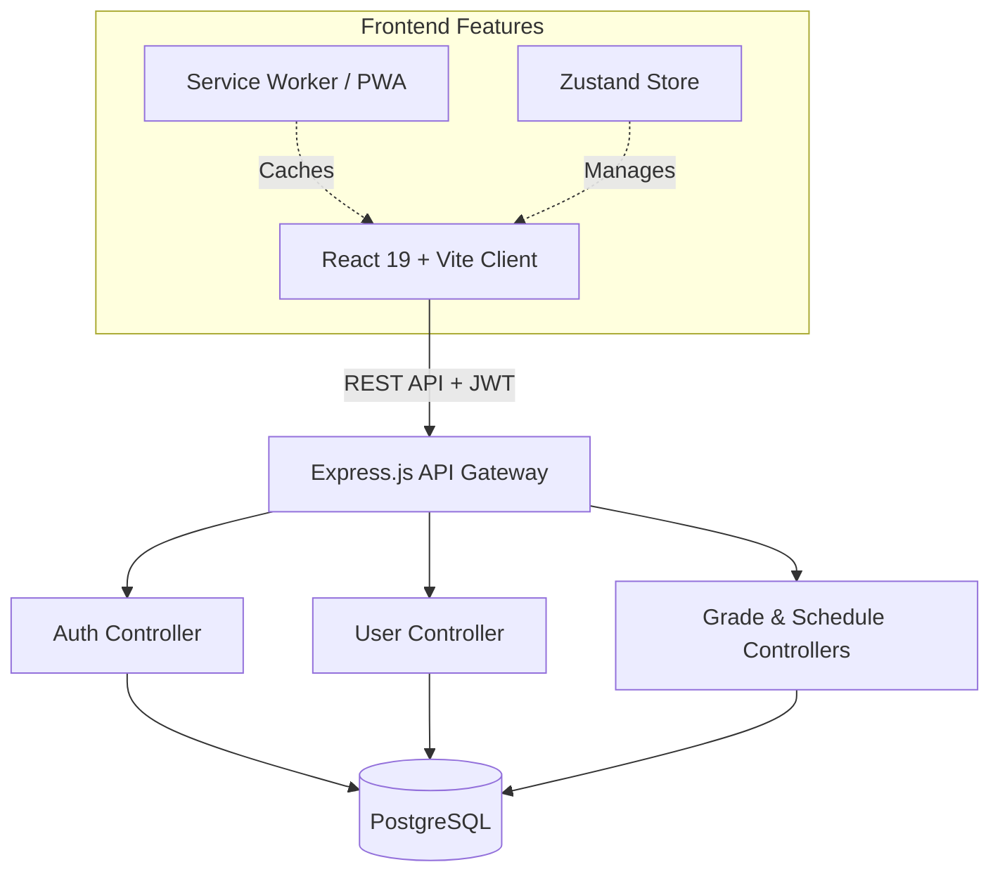

<div align="center">


# 🎓 Habucho Preparatory School Management System

**A production-ready Progressive Web Application (PWA) tailored for Grade 11–12 educational institutions.**

[](https://reactjs.org/)
[](https://vitejs.dev/)
[](https://tailwindcss.com/)
[](https://nodejs.org/)
[](https://www.postgresql.org/)

[](#)
[](#)
[](#)

[Overview](#-overview) • [Key Features](#-key-features) • [System Architecture](#-system-architecture) • [Getting Started](#-getting-started) • [API Documentation](#-api-documentation)

</div>

---

## 📖 Overview

The **Habucho Preparatory School Management System** is a unified digital workspace designed to bridge the gap between administrators, teachers, and students. By leveraging a modern tech stack and PWA capabilities, it delivers a lightning-fast, offline-capable, and highly secure environment for managing daily school operations.

---

## ✨ Key Features

<details open>
<summary><b>🔐 Role-Based Access Control (RBAC)</b></summary>
Secure, JWT-powered experiences tailored for three distinct roles:
<ul>
  <li><b>Admin:</b> Full system oversight, user management, and global analytics.</li>
  <li><b>Teacher:</b> Class schedules, announcement broadcasting, and advanced grading.</li>
  <li><b>Student:</b> Read-only access to personal grades, schedules, and a secure contact portal.</li>
</ul>
</details>

<details open>
<summary><b>⚡ Progressive Web App (PWA) Superpowers</b></summary>
<ul>
  <li><b>Installable:</b> Native-like app experience on iOS, Android, and Desktop.</li>
  <li><b>Offline Resiliency:</b> Service Workers cache core assets so the app loads instantly, even without an internet connection.</li>
  <li><b>Responsive UI:</b> Fluid layouts that adapt flawlessly to any screen size.</li>
</ul>
</details>

<details open>
<summary><b>📊 Advanced Grading & Analytics</b></summary>
<ul>
  <li><b>Excel-Style Grading:</b> Teachers can bulk-upsert grades using an intuitive, spreadsheet-like interface.</li>
  <li><b>Real-Time Dashboards:</b> Beautifully rendered Chart.js metrics for instant administrative insights.</li>
</ul>
</details>

<details open>
<summary><b>🛡️ Enterprise-Grade Security</b></summary>
<ul>
  <li><b>Helmet Middleware:</b> Enforces strict HTTP security headers.</li>
  <li><b>Data Protection:</b> Cryptographic hashing via <code>bcryptjs</code> and secure JWT token strategies.</li>
</ul>
</details>

---

## 🏗 System Architecture

The application follows a strict decoupled Client-Server architecture.



---

## 🚀 Getting Started

Follow these instructions to get a local development environment up and running.

### 📋 Prerequisites

Ensure you have the following installed:
- **Node.js** (v18.0.0 or higher)
- **PostgreSQL** (v12.0 or higher)

### 🛠️ Step-by-Step Installation

<details>
<summary><b>1. Database Configuration</b></summary>
<br/>
Open your PostgreSQL terminal and create the application database:

```sql
CREATE DATABASE habucho_school;
```
</details>

<details>
<summary><b>2. Backend Initialization</b></summary>
<br/>

```bash
cd server

# Install dependencies
npm install

# Setup environment variables
cp .env.example .env
# Note: Update .env with your DB credentials and a secure JWT_SECRET

# Initialize schema and populate demo data
npm run migrate
npm run seed

# Start the development server
npm run dev
```
*The API will be available at `http://localhost:5000`*
</details>

<details>
<summary><b>3. Frontend Initialization</b></summary>
<br/>

```bash
# In a new terminal window
cd client

# Install dependencies
npm install

# Link to local API
echo "VITE_API_URL=http://localhost:5000/api" > .env.local

# Start the Vite development server
npm run dev
```
*The UI will be available at `http://localhost:5173`*
</details>

---

## 👥 Demo Accounts

Use the following credentials to explore the system's role-based features immediately after seeding the database:

| Role | Email | Password | Dashboard Access |
| :--- | :--- | :--- | :--- |
| 👑 **Admin** | `admin@habucho.edu` | `Password123!` | `/admin` |
| 👨‍🏫 **Teacher**| `teacher@habucho.edu` | `Password123!` | `/teacher` |
| 🎓 **Student**| `student@habucho.edu` | `Password123!` | `/student` |

---

## 🔌 API Documentation

Our RESTful API is structured around clear, resource-oriented URLs.

| Resource | Endpoints | Access Level |
| :--- | :--- | :--- |
| **Auth** | `POST /auth/login`, `POST /auth/register` | Public |
| **Profile** | `GET /auth/profile` | Authenticated |
| **Users** | `GET /users`, `POST /users`, `GET /users/stats` | Admin |
| **Grades** | `GET /grades`, `POST /grades`, `PUT /grades/:id` | Admin, Teacher (Write), Student (Read) |
| **Schedules** | `GET /schedules`, `POST /schedules` | Admin (Write), All (Read) |
| **Notices** | `GET /announcements`, `POST /announcements` | Admin, Teacher (Write), All (Read) |

> 💡 **Tip:** All protected routes require an `Authorization: Bearer <token>` header.

---

## 📁 Directory Structure

A quick glance at how the repository is organized:

```text
Habucho-School-System/
├── client/                     # Frontend Application
│   ├── public/                 # Static PWA assets (Manifest, Icons, SW)
│   └── src/
│       ├── components/         # Shared UI components (StatCards, Reveals)
│       ├── dashboards/         # Role-specific layouts & views
│       ├── services/           # Axios API abstractions
│       └── context/            # Zustand stores & Theme providers
└── server/                     # Backend Application
    ├── controllers/            # Core business logic
    ├── middleware/             # Security (Helmet, CORS) & Auth validation
    ├── models/                 # Database query definitions
    └── migrations/             # SQL schema definitions & seeds
```

---

<div align="center">
  <br/>
  <b>Engineered with ❤️ for Habucho Preparatory School</b>
  <br/>
  <p>Providing the foundation for modern educational management.</p>
</div>
