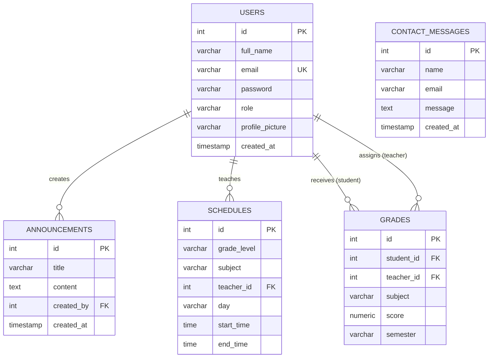

# Entity-Relationship Diagram

## Habucho Preparatory School Database

## Relationships

| Relationship | Type | Description |
|---|---|---|
| users → announcements | One-to-Many | A user (admin/teacher) can create many announcements |
| users → schedules | One-to-Many | A teacher can have many scheduled classes |
| users → grades (student) | One-to-Many | A student can have many grade records |
| users → grades (teacher) | One-to-Many | A teacher can assign many grades |
| contact_messages | Independent | No foreign keys — public submissions |

## Role Values

- `admin` — Full system access
- `teacher` — Manage grades, create announcements, view schedules
- `student` — View own grades, schedules, announcements; submit contact messages
